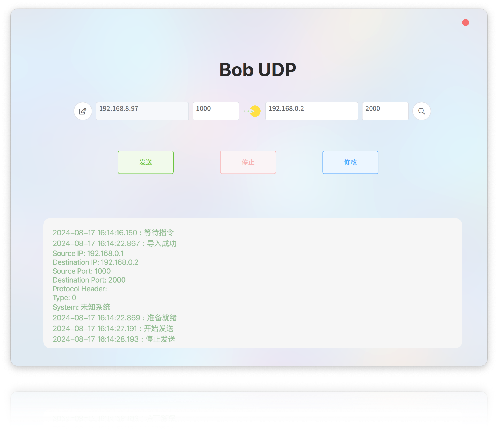
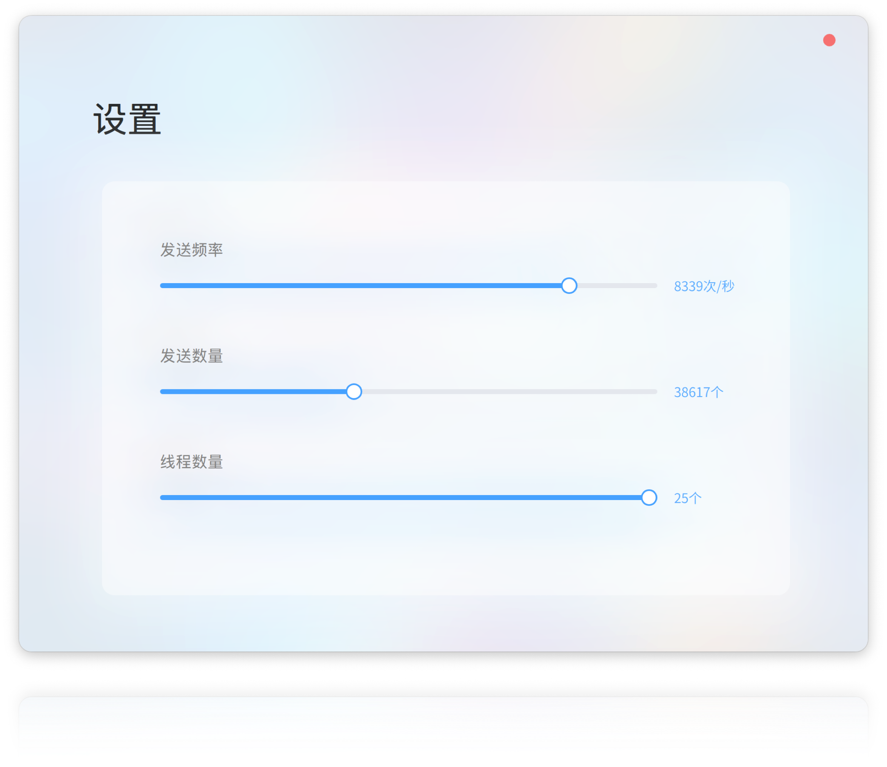

# BobUDP-北京交通大学高级软件研发实践大作业

| 系统    | 架构        | 可用           |
| ------- | ----------- | -------------- |
| MacOS   | ARM, x64    | 是             |
| Windows | ARM，x86_64 | 是             |
| Linux   | x86_64      | 是，但未经测试 |

## 界面及操作流程设计

##### 1. 导入xml文件

##### 2. 用户修改目标 IP、目标端口、在设置界面修改数量、频率、线程。

##### 3. 点击 “发送” 按钮，系统进行数据发送，并在后台记录发送信息。

##### 4. 点击 “停止” 按钮，系统停止数据发送。

##### 5. 在搜索界面搜索发送或接收记录。

## 功能及程序业务逻辑设计

### udpserver

该类主要功能是用于发送和接收数据包。

#### 主要组件：

1. **类定义**：

   - `UDPServer`：继承自 `QObject` 的类，是 UDP 服务器的核心实现。
2. **构造函数与析构函数**：

   - `explicit UDPServer(QObject *parent = nullptr);`：构造函数，允许设置父对象。
   - `~UDPServer();`：析构函数，释放资源。
3. **公共方法**：

   - `void startSending();` 与 `void stopSending();`：控制数据发送的开始和停止。
   - `bool bind(QString ip, QString port);`：将服务器绑定到指定的 IP 地址和端口。
   - `void setDestIP(QString destIP);` 与 `void setDestPort(QString destPort);`：设置目标 IP 和端口，用于数据发送。
   - `void setThreadNum(int num);`：设置线程数。
   - `void setFieldDefinitions(QList<FieldDefinition> fieldDefinitions);`：设置字段定义列表。
   - `QByteArray generateRandomData(const FieldDefinition &field);`：基于字段定义生成随机数据。
   - `QList<QByteArray> generateMessageData(QList<FieldDefinition> fieldDefinitions);`：生成消息数据列表。
   - `static void saveDataToDatabase(QSqlDatabase db, const QString &senderIp, quint16 senderPort, const QByteArray &data);`：静态方法用于将数据保存到数据库。
   - `QVariantList searchInSendDb(const QString &searchTerm);` 与 `QVariantList searchInRecDb(const QString &searchTerm);`：在发送和接收数据库中进行搜索。
4. **私有成员变量**：

   - 存储 UDP 相关信息的变量，包括 IP 地址、端口、数据包计数器、线程池等。
   - 数据库对象 `QSqlDatabase m_db_rec` 和 `QSqlDatabase m_db_send` 用于记录发送和接收的数据。
5. **信号**：

   - `void errorOccurred(const QString &error);`：在发生错误时触发的信号。
   - `void packetSent();`：表示数据包已发送的信号。
   - `void sendFinished();`：表示发送操作完成的信号。
6. **私有槽**：

   - `void sendPacket();`：执行发送数据包的任务。
   - `void receivePacket();`：处理接收的数据包。

### sendtablemodel

该类用于处理和展示数据模型。

#### 主要内容：

1. **类定义**：

   - `SendTableModel` 类定义为 `QAbstractListModel` 的子类，用于在qml中实现表格功能。
2. **角色定义**：

   - `RoleNames` 枚举定义了五个角色，分别是：
     - `IdRole`：用户角色 Id
     - `TimestampRole`：时间戳
     - `SenderIpRole`： IP
     - `SenderPortRole`：端口
     - `DataRole`：数据内容
3. **构造函数**：

   - `explicit SendTableModel(QObject *parent = nullptr)`：构造函数，接受一个可选的父对象。
4. **虚函数重载**：

   - `rowCount()`：返回数据模型中的行数。
   - `data()`：根据索引和角色返回相应的数据。
   - `roleNames()`：重载以返回角色名称的哈希映射。
5. **可调用方法**：

   - `addData(const QVariantMap &data)`：用于添加数据到模型。
   - `clearData()`：清空模型中的数据。
6. **私有成员**：

   - `m_data`：一个 `QList<QVariantMap>` 类型的成员变量，用于存储数据。

## controller

`controller` 类，该类继承自 `QQuickItem`，并使用 Qt 框架进行开发。此类主要负责处理与 XML 文件解析、网络通信和信号槽机制相关的功能，qml通过此类与c++进行交互。

### 主要成员和功能

1. **类定义**:

   - `class controller`：ml通过此类与c++进行交互。
2. **公共方法**:

   - `selectXMLFile(const QString &fileUrl)`：选择 XML 文件。
   - `getProtocolConfigAsString()`：获取协议配置的字符串表示。
   - `getSourceIP()`, `getSourcePort()`, `getDestinationIP()`, `getDestinationPort()`：获取和返回源和目的地的 IP 和端口。
   - `setDestinationIP(QString DestIP)`、`setDestinationPort(QString DestPort)`：设置目的地的 IP 和端口。
   - `checkIPString(QString ipStr)`、`checkPortString(QString portStr)`：验证 IP 地址和端口字符串格式。
   - `setFrequence(QString Freq)`、`setNumber(QString Num)`、`setThreadNum(QString ThreadNum)`：设置频率、数量和线程数。
   - `searchInSendDb(const QString &searchTerm)` 和 `searchInRecDb(const QString &searchTerm)`：在发送和接收数据库中进行搜索。
3. **信号**:

   - `xmlFilePathChanged()`, `protocolConfigChanged()`, `sendingStarted()`, `sendingStopped()`, `sendingStateChanged()`：定义了一些信号，用于状态和数据变化的通知。
4. **私有成员**:

   - `XMLProtocolParser m_xmlParser`：用于解析 XML 协议配置。
   - `ProtocolConfig m_protocolConfig`：存储协议配置信息。
   - `QList<FieldDefinition> m_fieldDefinitions`：字段定义列表。
   - `UDPServer m_udpServer`：用于 UDP 服务器处理。
   - `bool m_isSending`：标志发送状态。
   - `SendTableModel sendTableModel`：用于管理发送数据的模型。
5. **公共槽**:

   - `startSending()`：启动发送操作。
   - `stopSending()`：停止发送操作。
     文件名：`udpreceivetask.h`

## ReceiveTask

概述：`ReceiveTask` 的类，该类继承自 `QRunnable`，用于处理接收到的UDP数据报。

主要内容：

1. **类定义**：

   - `ReceiveTask` 类接收四个参数：一个指向 `QUdpSocket` 的指针、发送者的地址、发送者的端口和接收到的数据。
   - 构造函数将这些参数初始化为成员变量。
2. **成员方法**：

   - `run()` 方法被重写，负责处理接收到的UDP数据报，并在调试输出中显示发送者信息和数据内容。
3. **私有成员**：

   - 包含用于存储接收到数据的成员变量：`m_socket`（UDP套接字指针）、`m_sender`（发送者地址）、`m_senderPort`（发送者端口）、`m_data`（接收到的数据）。
4. **预处理指令**：

   - 使用宏保护防止头文件重复包含。

### udpsendtask

该文件定义了一个名为 `SendTask` 的类，该类继承自 `QRunnable`，用于通过 UDP 套接字发送数据报。

#### 主要内容：

1. **包含的头文件**：

   - `QRunnable`、`QUdpSocket`、`QObject` 等，这是 Qt 框架的类，支持多线程和网络通信。
   - 还包含了一些其他的 Qt 组件，如 `QFile`、`QMessageBox`、`QWidget`、`QString`、`QTimer`、`QRandomGenerator` 和 `QThreadPool`。
2. **类 `SendTask`**：

   - **构造函数**：接受一个 `QUdpSocket` 指针、要发送的数据、目标 IP 地址和目标端口号，并初始化相应的成员变量。
   - **成员函数**：
     - `run()`：重写了 `QRunnable` 的 `run` 方法，负责发送数据报并打印发送的信息到调试输出。
3. **私有成员变量**：

   - `m_socket`：指向用于发送数据的 UDP 套接字。
   - `m_data`：待发送的字节数组数据。
   - `m_destIP`：目标 IP 地址的字符串表示。
   - `m_destPort`：目标端口号。

#### 线程安全：

`SendTask` 类是设计用于在 `QThreadPool` 中并发执行，在多线程环境中可以安全地发送数据。

## xmlprotocolparser.h

`XMLProtocolParser`类用于解析XML格式的协议文件。

#### 数据结构

1. **FieldDefinition**：此结构体用于定义字段的属性，包括：

   - `fieldName`: 字段名称
   - `isSelected`: 字段是否被选中
   - `datatype`: 数据类型
   - `data`: 字段信息
   - `bitIndex`: 字段的起始位置
   - `length`: 字段长度
   - `loopEnd`: 字段结束位置
   - `comment`: 字段说明
   - `minimum`: 最小值
   - `maximum`: 最大值
   - `precision`: 精度
   - `isKey`: 是否为关键字段
2. **ProtocolConfig**：此结构体存储协议的配置信息，包括：

   - `sourceIP`: 源IP地址
   - `destIP`: 目的IP地址
   - `sourcePort`: 源端口
   - `destPort`: 目的端口
   - `protoHead`: 报文头
   - `nType`: 报文类型
   - `system`: 系统信息

#### 类

- **XMLProtocolParser**类：
  - 构造函数：`XMLProtocolParser()`，用于初始化对象。
  - 公有方法：
    - `bool parseProtocol(const QString &filePath);`：解析给定路径的协议文件。
    - `QList<FieldDefinition> getFieldDefinitions() const;`：获取字段定义列表，使用`const`修饰以防止修改对象状态。
    - `ProtocolConfig getProtocolConfig();`：获取协议配置信息。
  - 私有成员：
    - `QList<FieldDefinition> fieldDefinitions;`：存储字段定义的列表。
    - `ProtocolConfig protocolConfig;`：存储协议配置信息。

## 数据库设计

### 数据库名称

* **已接收消息**:`udp_data_rec`
* **已发送消息**:udp_data_send`

### 表名

* **Table Name**:`udp_data`

### 主外键关系

* **主键**:** **`id` 是表** **`records` 的主键，唯一标识每一条记录。
* **外键**: 本表没有定义外键关系，但可以根据需要与其他表建立联系。

### 说明

* `id`: 自动递增的唯一标识符，用于区分每一条记录。
* `sender_ip`: 存储发送者的 IP 地址，不能为空。
* `sender_port`: 存储发送者的端口号，不能为空。
* `timestamp`: 记录数据发送的时间，默认值为当前时间，不能为空。
* `data`: 存储发送的数据内容，不能为空。

### 字段定义

| 字段名      | 字段含义     | 字段类型    | 约束        | 默认值            |
| ----------- | ------------ | ----------- | ----------- | ----------------- |
| id          | 记录唯一标识 | INT         | PRIMARY KEY | AUTO_INCREMENT    |
| sender_ip   | IP地址       | VARCHAR(15) | NOT NULL    | N/A               |
| sender_port | 端口         | INT         | NOT NULL    | N/A               |
| timestamp   | 记录发送时间 | DATETIME    | NOT NULL    | CURRENT_TIMESTAMP |
| data        | 数据内容     | TEXT        | NOT NULL    | N/A               |
